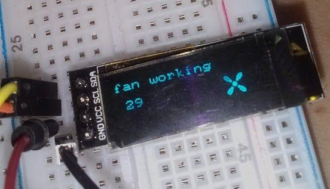
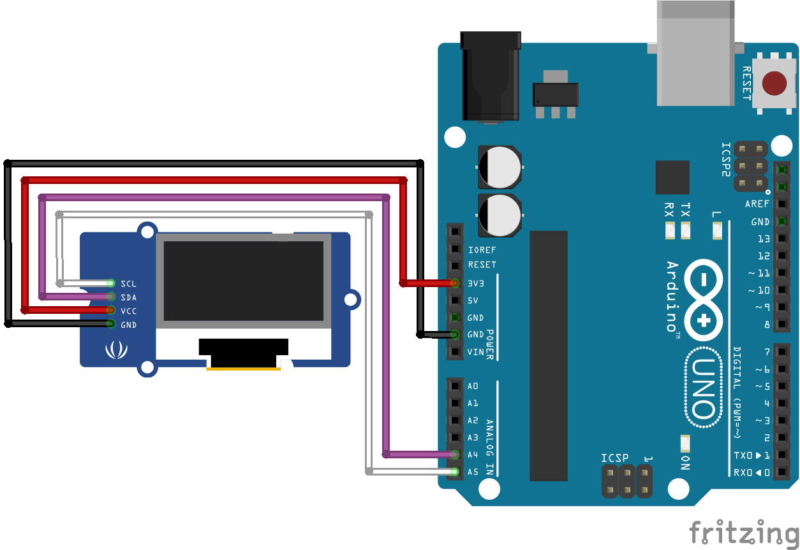

# u8x8 example on Arduino UNO R3 with a 128x32 I2C OLED Display
Playground for u8x8lib on a I2C 128x32 OLED display based on SSD1306 drivers, which I bought on eBay.

## Technologies used:
+ [u8x8 library from u8g2 project](https://github.com/olikraus/u8g2) [u8x8 reference](https://github.com/olikraus/u8g2/wiki/u8x8reference)
+ [Atom IDE with PlatformIO](https://platformio.org/)
+ [Fritzing for drawing a schematic](http://fritzing.org)

------
#### This repo also includes an *examples* folder of:
* how to debounce a momentary button in an interrupt
* how to debounce a momentary button in main loop
* ..an alternative of the __delay()__ function, how all we know it pauses the code in main loop by using an interrupt routine..
* how to pass a function as a parameter in a function
